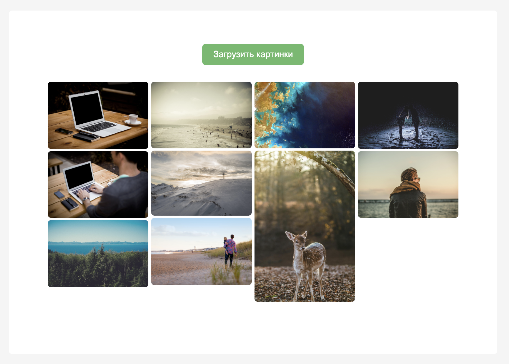
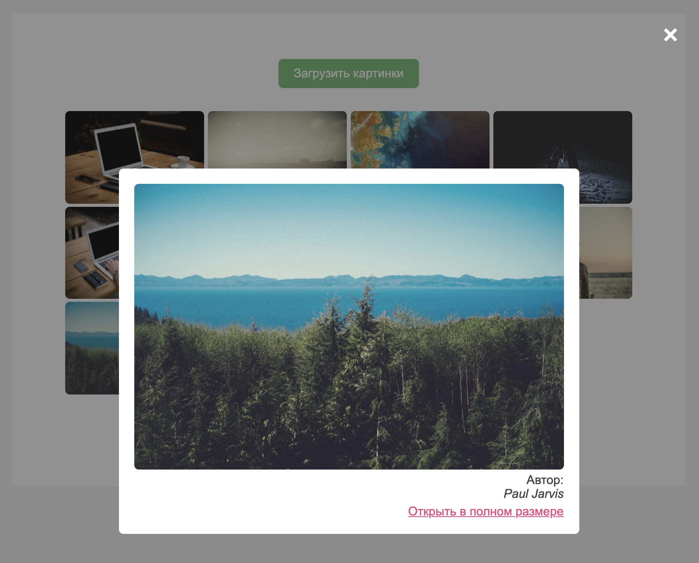

# 📝 Чек-лист

1) Ознакомьтесь с материалом лекций недели
2) Ознакомьтесь с материалами воркшопа
3) Ознакомьтесь с заданием
4) Создайте ветку `feature/…` и выполните задание в ней
5) Подготовьте PR из ветки `feature/…` в ветку `main`
6) Найдите в таблице прогресса своего тьютора
7) Отправьте личным сообщением своему тьютору ссылку на созданный PR

-----------------------

# ✨ Задание: Like Pinterest
## 📌 Описание

Есть некое приложение, которое позволяет подгружать популярные фотографии в хоршем качестве и даёт их бесплатно скачать.

### Главный экран

Есть кнопка, по которой подгружается партия популярных фотографий. 1 партия = 10 фотографиям. Всего есть возможность загрузить 34 партии (старницы).

### Попап

Каждую фотографию можно открыть в увеличенном варианте, по клику на неё открывается попап, где можно узнать кто автор. Там же есть ссылка для открытия фотографии в полном разрешении, откуда её уже можно скачать.
Попап закрывается по нажатию на крестик.

## 🐞Проблема
Приложение не работает. При открытии страницы зависает лоадер и больше ничего не происходит, а разработчик который его писал уехал в другую страну и больше не отвечает.. 😳

Хорошо что в коде он оставил подсказки в виде небольшой документации, и чтобы разобраться в том что произошло с приложением и починить его нужно разобраться в DevTools, прочитать ошибки в консоли и исправить их. 🛠️
